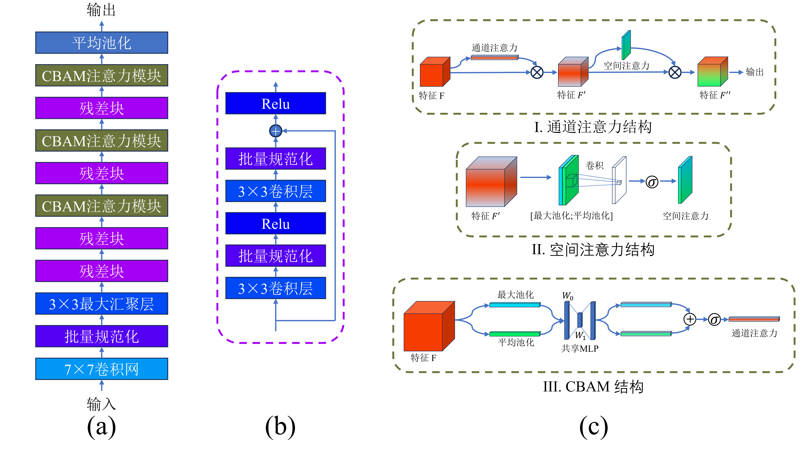
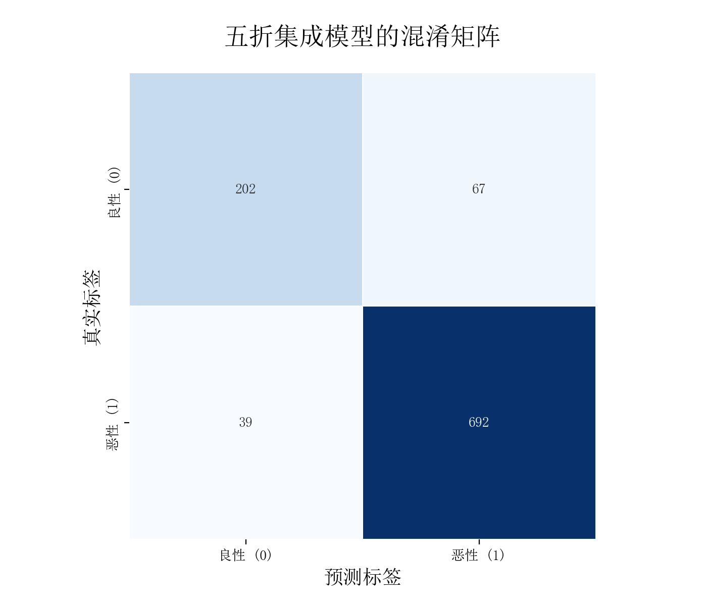
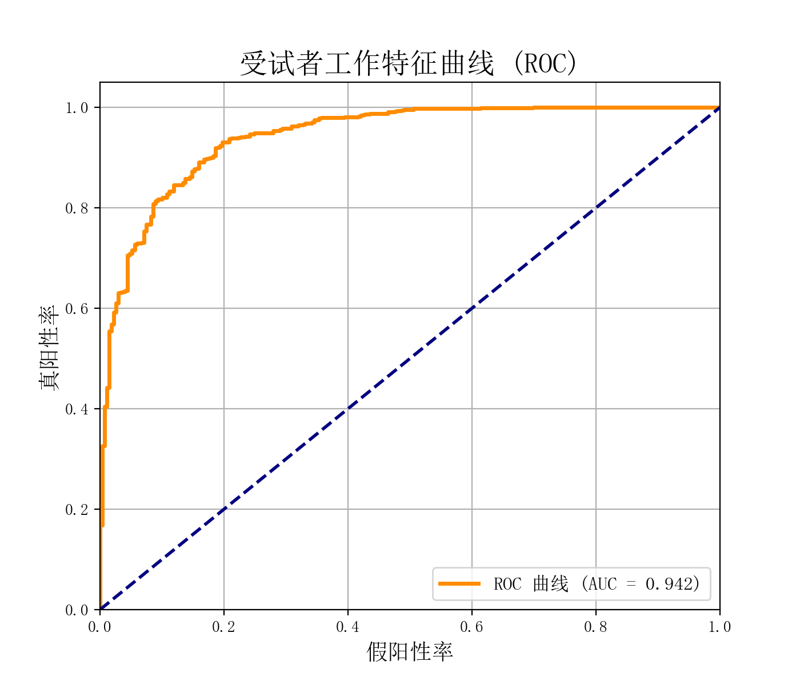
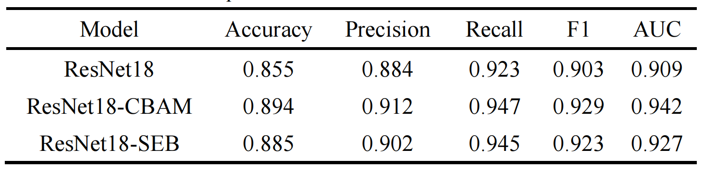

# ResNet18-CBAM-Thyroid-Ultrasound-Classification
## Dataset
We use the publicly available TN5000 thyroid ultrasound dataset introduced by Huan Zhang et al. in  
[TN5000: An Ultrasound Image Dataset for Thyroid Nodule Detection and Classification](https://www.nature.com/articles/s41597-025-05757-4).
## Framework
We enhance ResNet by incorporating the CBAM attention module to improve classification performance.

## Training Strategy
We adopt 5-fold cross-validation to improve model generalization under limited data. Adam optimizer is used with an initial learning rate of 1 × 10⁻⁴, which is reduced by a factor of 0.5 if validation performance does not improve for two consecutive epochs. Cross-entropy loss with label smoothing (ε = 0.1) is applied to mitigate overconfident predictions and improve generalization.
## Evaluate
After obtaining the optimal weights from the five folds, all trained models are used to predict each test sample. The final prediction is obtained by averaging the probabilities from different folds, with a threshold of 0.5 for benign–malignant classification. The proposed ResNet18-CBAM model demonstrates strong performance on the test set, achieving high sensitivity to malignant nodules and an AUC of 0.942, indicating robust overall classification ability.

**Confusion Matrix**

   
  <b>Figure 1.</b> Confusion matrix of the ResNet18-CBAM model on the test set.

**ROC Curve**

   
  <b>Figure 2.</b> ROC curve of the ResNet18-CBAM model with an AUC of 0.942.

### Model Comparison
Compared with the baseline ResNet18 and the SE-based (Squeeze-and-Excitation Block) variant under identical training conditions, the ResNet18-CBAM model consistently outperforms both across all evaluation metrics. In particular, the CBAM model shows a more notable improvement in AUC, indicating that the joint use of channel and spatial attention is more effective than channel attention alone for thyroid nodule classification.

   
  <b>Figure 3.</b> Performance comparison among ResNet18, SE-ResNet18, and ResNet18-CBAM.

